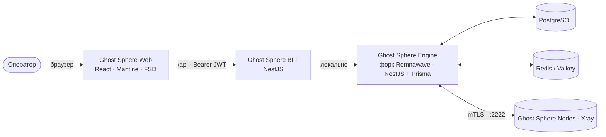

<div align="center">


# Ghost Sphere

**Премиальная единая панель управления экосистемой VPN**
**The premium unified control plane for the VPN ecosystem**

`v0.0.1` · Developed by **Ghost OS**

[Возможности](#-возможности) · [Быстрый старт](#-быстрый-старт) · [Архитектура](#-архитектура) · [English](#-english)

📖 **Полное руководство:** [Русский](docs/GUIDE.ru.md) · [English](docs/GUIDE.en.md)

</div>

---

> **Ghost Sphere** — это центр управления, который объединяет всю экосистему Remnawave в одном тёмном, технологичном и быстром интерфейсе. Ноды, конфигурации Xray, пользователи, подписки, ключи, боты, бэкапы и хранилище шаблонов — всё в одной сфере. Установил и пользуйся.

## ✨ Возможности

| Модуль | Что умеет |
| --- | --- |
| 🌐 **Обзор сферы** | Живые метрики, «мощность сферы», графики роста и нагрузки, лента событий, CPU/RAM/аптайм |
| 🖥 **Ноды** | Карточки/таблица, создание, мастер установки (одна команда + SECRET_KEY), включение/перезапуск/сброс, живая нагрузка |
| 🧩 **Конфигурации Xray** | Профили, редактор Monaco с подсветкой и проверкой по схеме Xray, генерация ключей X25519, сниппеты |
| 🔌 **Хосты** | Точки подключения с REALITY/TLS, SNI, ALPN, отпечатками |
| 👤 **Пользователи** | Создание ключей, лимиты трафика, сроки, статус онлайн, копирование подписки, массовые действия |
| 🔗 **Подписки** | Xray JSON/Base64, Clash, Mihomo, Sing-box, Stash, шаблоны и настройки выдачи |
| 👥 **Сквады** | Внутренние и внешние группы доступа к инбаундам |
| 🔑 **Ключи и токены** | API-токены, сертификаты нод (mTLS), генерация X25519, зашифрованное хранилище секретов |
| 🤝 **Интеграции** | Telegram-магазин, админ-бот, Cloudflare-ноды, Xray Checker, Whitebox, MCP, бэкап-агент, WARP |
| 💾 **Бэкапы** | Локально / S3 / Google Drive / Telegram, расписание, восстановление |
| 📦 **Хранилище** | Каталог шаблонов: Xray-конфиги, подписки, страницы, SRR, плагины нод |
| 📖 **Руководство** | Встроенный гид по управлению — на русском и английском |

**Премиум-детали:** тёмная тема Ghost OS, спектральное свечение и стекло, командная палитра (`Ctrl + K`), плавные ненавязчивые анимации, полная локализация **RU / EN**, демо-режим из коробки.

## 🚀 Быстрый старт

### Вариант 0 — установка на сервер одной командой (Ubuntu/Debian, рекомендуется)

Ставит чистый Docker CE + Compose v2, клонирует репозиторий в `/opt/ghost-sphere` и поднимает весь стек:

```bash
curl -fsSL https://raw.githubusercontent.com/SKINOREZZZ101/SPHEREGHOST/main/scripts/install.sh | sudo bash
```

Через 3–6 минут откройте `http://<IP-сервера>:8080` → вкладка **«Регистрация»**. Откройте порт `8080/tcp` в фаерволе.

### Вариант 1 — Docker вручную

```bash
cd SPHERE-GHOST
docker compose up -d --build
```

Откройте **http://localhost:8080**, на вкладке **«Регистрация»** создайте первого администратора (или нажмите **«Войти в демо-режиме»**, чтобы изучить всё на демо-данных). Поднимется весь стек: PostgreSQL + Redis + наш движок + BFF + интерфейс.

> Порт настраивается переменной `GHOST_SPHERE_PORT` (по умолчанию `8080`).
> Для продакшена смените `JWT_AUTH_SECRET`, `JWT_API_TOKENS_SECRET` и пароль Postgres.

### Вариант 2 — Локальная разработка

```bash
# 1) Поднимите базу и Redis для движка
docker compose up -d db redis

# 2) Движок (форк Remnawave): миграции + сервер
cd backend && npm install && npm run migrate:generate && npm run migrate:deploy && npm run start:prod

# 3) BFF + интерфейс
npm run dev:api      # http://127.0.0.1:8088
npm run dev:web      # http://127.0.0.1:4173
```

## 🧠 Архитектура (самодостаточная — всё наше)



- **Ghost Sphere Web** — премиальный SPA (React 19, Vite, Mantine 8, TanStack Query, Zustand, i18next, Framer Motion, Monaco). Работает автономно в демо-режиме.
- **Ghost Sphere BFF** — слой API на NestJS, отдаёт интерфейсу удобные DTO и проксирует логин к движку.
- **Ghost Sphere Engine** — **полноценный форк backend Remnawave** (NestJS + Prisma + PostgreSQL + Redis + BullMQ): пользователи, подписки, ноды, конфиги Xray, mTLS-связь с нодами. Это **наша** панель, никакой внешней Remnawave.
- **Ghost Sphere Nodes** — форк node Remnawave (Xray-агент), ставится на VPN-серверы.

### Структура репозитория

```
SPHERE-GHOST/
├── web/                 # Интерфейс (React + Vite + Mantine, наш дизайн)
├── api/                 # Ghost Sphere BFF (NestJS) — API-слой для интерфейса
├── backend/             # Ghost Sphere Engine — форк backend Remnawave (движок панели)
│   ├── src/modules/     # users · nodes · hosts · config-profiles · subscription · ...
│   └── prisma/          # схема БД (PostgreSQL)
├── node/                # Ghost Sphere Node — форк node Remnawave (агент на серверах)
├── scripts/             # install-node.sh
├── docs/                # руководства RU/EN + скриншоты
└── docker-compose.yml   # postgres + redis + engine + bff + web — одна команда
```

## 🔗 Интеграция с экосистемой

Ghost Sphere спроектирован как «крыша» над всем форком Remnawave:

| Ghost Sphere | Проект экосистемы |
| --- | --- |
| Ноды / провижининг | `node`, `remnawave-cloudflare-nodes`, `warp-native` |
| Конфигурации | `xray-config-ui-editor`, `xray-monaco-editor`, `templates` |
| Магазин / CRM | `remnawave-minishop` |
| Операции / NOC | `remnawave-admin`, `xray-checker`, `whitebox` |
| Автоматизация | `mcp-remnawave`, `python-sdk` |
| Аварийное восстановление | `remnawave-backup-restore` |
| Миграция | `migrate` |

## 🗂 Версионирование

Проект стартует с **`0.0.1`** и следует [SemVer](https://semver.org/lang/ru/). Версия задаётся в `web/package.json`, `api/package.json` и `api/src/common/version.ts`.

---

## 🇬🇧 English

**Ghost Sphere** is a **self-contained fork of the Remnawave engine** — your own panel, your own database, your own nodes — wrapped in one dark, technological, premium interface. Nodes, Xray configs, users, subscriptions, keys, bots, backups and a template library, all in a single sphere. Install and use.

### Quick start

```bash
cd SPHERE-GHOST
docker compose up -d --build
# open http://localhost:8080 → create the first admin (Register tab) or click "Enter demo mode"
```

This brings up the full stack: **PostgreSQL + Redis + Ghost Sphere Engine + BFF + Web**. For production, change `JWT_AUTH_SECRET`, `JWT_API_TOKENS_SECRET` and the Postgres password.

Local development:

```bash
docker compose up -d db redis          # database + redis for the engine
cd backend && npm install && npm run migrate:generate && npm run migrate:deploy && npm run start:prod
npm run dev:api    # BFF  → http://127.0.0.1:8088
npm run dev:web    # Web  → http://127.0.0.1:4173
```

### Highlights

- Premium dark **Ghost OS** theme — spectral glow, glass surfaces, restrained motion
- Command palette (`Ctrl + K`), full **RU / EN** localization, out-of-the-box demo mode
- Nodes, Xray config editor (Monaco + schema validation), users & keys, subscriptions, squads, integrations, backups, template storage
- **Self-contained engine** — a full Remnawave fork with its own PostgreSQL, Redis, Prisma, BullMQ and mTLS node control. No external panel.

### Tech stack

`React 19` · `Vite` · `Mantine 8` · `TanStack Query` · `Zustand` · `i18next` · `Framer Motion` · `Monaco` · `NestJS 11` · `Prisma` · `PostgreSQL` · `Redis` · `Docker`

---

<div align="center">

**Ghost Sphere** — _«Призрачная точность. Сферический контроль.»_

Made with care by **Ghost OS** · AGPL-3.0

</div>
