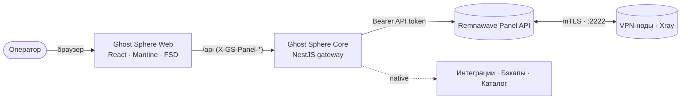

<div align="center">


# Ghost Sphere

**Премиальная единая панель управления экосистемой VPN**
**The premium unified control plane for the VPN ecosystem**

`v0.0.1` · Developed by **Ghost OS**

[Возможности](#-возможности) · [Быстрый старт](#-быстрый-старт) · [Архитектура](#-архитектура) · [English](#-english)

📖 **Полное руководство:** [Русский](docs/GUIDE.ru.md) · [English](docs/GUIDE.en.md)

</div>

---

> **Ghost Sphere** — это центр управления, который объединяет всю экосистему Remnawave в одном тёмном, технологичном и быстром интерфейсе. Ноды, конфигурации Xray, пользователи, подписки, ключи, боты, бэкапы и хранилище шаблонов — всё в одной сфере. Установил и пользуйся.

## ✨ Возможности

| Модуль | Что умеет |
| --- | --- |
| 🌐 **Обзор сферы** | Живые метрики, «мощность сферы», графики роста и нагрузки, лента событий, CPU/RAM/аптайм |
| 🖥 **Ноды** | Карточки/таблица, создание, мастер установки (одна команда + SECRET_KEY), включение/перезапуск/сброс, живая нагрузка |
| 🧩 **Конфигурации Xray** | Профили, редактор Monaco с подсветкой и проверкой по схеме Xray, генерация ключей X25519, сниппеты |
| 🔌 **Хосты** | Точки подключения с REALITY/TLS, SNI, ALPN, отпечатками |
| 👤 **Пользователи** | Создание ключей, лимиты трафика, сроки, статус онлайн, копирование подписки, массовые действия |
| 🔗 **Подписки** | Xray JSON/Base64, Clash, Mihomo, Sing-box, Stash, шаблоны и настройки выдачи |
| 👥 **Сквады** | Внутренние и внешние группы доступа к инбаундам |
| 🔑 **Ключи и токены** | API-токены, сертификаты нод (mTLS), генерация X25519, зашифрованное хранилище секретов |
| 🤝 **Интеграции** | Telegram-магазин, админ-бот, Cloudflare-ноды, Xray Checker, Whitebox, MCP, бэкап-агент, WARP |
| 💾 **Бэкапы** | Локально / S3 / Google Drive / Telegram, расписание, восстановление |
| 📦 **Хранилище** | Каталог шаблонов: Xray-конфиги, подписки, страницы, SRR, плагины нод |
| 📖 **Руководство** | Встроенный гид по управлению — на русском и английском |

**Премиум-детали:** тёмная тема Ghost OS, спектральное свечение и стекло, командная палитра (`Ctrl + K`), плавные ненавязчивые анимации, полная локализация **RU / EN**, демо-режим из коробки.

## 🚀 Быстрый старт

### Вариант 1 — Docker (рекомендуется)

```bash
cd SPHERE-GHOST
docker compose up -d --build
```

Откройте **http://localhost:8080**, введите адрес панели Remnawave и API-токен — или нажмите **«Войти в демо-режиме»**, чтобы изучить всё на демо-данных.

> Порт настраивается переменной `GHOST_SPHERE_PORT` (по умолчанию `8080`).

### Вариант 2 — Локальная разработка

```bash
# Установка зависимостей
npm run install:all

# Терминал 1 — ядро (NestJS gateway)
npm run dev:api      # http://127.0.0.1:8088

# Терминал 2 — интерфейс (Vite + React)
npm run dev:web      # http://127.0.0.1:4173
```

Vite проксирует `/api` на Ghost Sphere Core автоматически.

## 🧠 Архитектура



- **Ghost Sphere Web** — премиальный SPA (React 19, Vite, Mantine 8, TanStack Query, Zustand, i18next, Framer Motion, Monaco). Работает автономно в демо-режиме.
- **Ghost Sphere Core** — stateless-шлюз на NestJS. Учётные данные панели передаются заголовками `X-GS-Panel-*`, поэтому одно ядро обслуживает несколько панелей.
- **Remnawave Panel** — источник истины: ноды, конфиги, пользователи, подписки.

### Структура репозитория

```
SPHERE-GHOST/
├── web/                 # Интерфейс (React + Vite + Mantine)
│   ├── src/app/         # Оболочка: layout, роутинг, командная палитра
│   ├── src/pages/       # 15 страниц
│   ├── src/shared/      # Тема Ghost OS, i18n RU/EN, API-клиент, UI-кит
│   └── src/entities/    # Zustand-сторы (сессия, настройки)
├── api/                 # Ghost Sphere Core (NestJS gateway)
│   └── src/modules/     # system · nodes · catalog · users · native
├── scripts/             # install-node.sh
└── docker-compose.yml   # установка одной командой
```

## 🔗 Интеграция с экосистемой

Ghost Sphere спроектирован как «крыша» над всем форком Remnawave:

| Ghost Sphere | Проект экосистемы |
| --- | --- |
| Ноды / провижининг | `node`, `remnawave-cloudflare-nodes`, `warp-native` |
| Конфигурации | `xray-config-ui-editor`, `xray-monaco-editor`, `templates` |
| Магазин / CRM | `remnawave-minishop` |
| Операции / NOC | `remnawave-admin`, `xray-checker`, `whitebox` |
| Автоматизация | `mcp-remnawave`, `python-sdk` |
| Аварийное восстановление | `remnawave-backup-restore` |
| Миграция | `migrate` |

## 🗂 Версионирование

Проект стартует с **`0.0.1`** и следует [SemVer](https://semver.org/lang/ru/). Версия задаётся в `web/package.json`, `api/package.json` и `api/src/common/version.ts`.

---

## 🇬🇧 English

**Ghost Sphere** is the control center that unifies the entire Remnawave ecosystem in one dark, technological, fast interface — nodes, Xray configs, users, subscriptions, keys, bots, backups and a template library, all in a single sphere. Install and use.

### Quick start

```bash
cd SPHERE-GHOST
docker compose up -d --build
# open http://localhost:8080 → connect your panel or click "Enter demo mode"
```

Local development:

```bash
npm run install:all
npm run dev:api    # NestJS gateway → http://127.0.0.1:8088
npm run dev:web    # Vite + React  → http://127.0.0.1:4173
```

### Highlights

- Premium dark **Ghost OS** theme — spectral glow, glass surfaces, restrained motion
- Command palette (`Ctrl + K`), full **RU / EN** localization, out-of-the-box demo mode
- Nodes, Xray config editor (Monaco + schema validation), users & keys, subscriptions, squads, integrations, backups, template storage
- Stateless NestJS gateway that proxies to any Remnawave panel via forwarded credentials

### Tech stack

`React 19` · `Vite` · `Mantine 8` · `TanStack Query` · `Zustand` · `i18next` · `Framer Motion` · `Monaco` · `NestJS 11` · `Docker`

---

<div align="center">

**Ghost Sphere** — _«Призрачная точность. Сферический контроль.»_

Made with care by **Ghost OS** · AGPL-3.0

</div>
